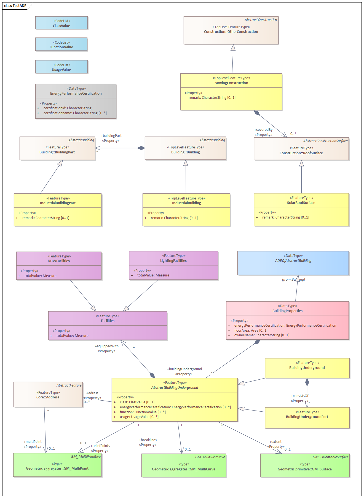

Test ADE extension
==================

The _Test ADE_ is an artificial CityGML Application Domain Extension (ADE) for testing and
demonstrating the ADE support of the 3D City Database that has been introduced with version 4.0. It has been designed
to cover the most relevant UML modelling elements and techniques that occur in real-world CityGML ADEs such as
subtyping or property injection.

This repository provides a reference implementation of an **ADE extension** that is required by the Importer/Exporter
tool to handle Test ADE datasets and manage them in the database. The reference implementation shows developers how to
implement the ADE-specific APIs of [citygml4j](https://github.com/citygml4j/citygml4j) (see `test-ade-citygml4j` module) and of the Importer/Exporter
(see `test-ade-citydb` module). Since the Test ADE reflects commonly used ADE modelling elements, the provided code may
serve as template for implementing extensions for other ADEs.

General steps for supporting an ADE with the 3DCityDB
-----------------------------------------------------
Adding support for a CityGML ADE to the 3DCityDB generally involves three steps:

1. Mapping the XML Schema definition of the ADE to a relational schema that integrates with the 3DCityDB core schema
   (for instance, by reusing `SURFACE_GEOMETRY` to store surface-based spatial properties of features).
2. Creating an XML-based schema mapping file that captures the mapping between elements of the XML schema and elements
   of the relational schema (see the [schema mapping](https://github.com/3dcitydb/importer-exporter/blob/master/impexp-core/src/main/resources/org/citydb/core/database/schema/3dcitydb-schema.xml) between the CityGML XML schemas and the 3DCityDB core schema).
3. Registering the ADE with the metadata tables of the 3DCityDB.

With the [ADE Manager Plugin](https://github.com/3dcitydb/plugin-ade-manager) we provide a tool that fully automates these steps. It reads the XML schema and
applies a rule-based transformation to derive a relational schema for the ADE that seamlessly integrates with the
3DCityDB. Users can redefine default rules or even add new rules, and thus have full control over the mapping result.
You can easily test the mapping and registration with the [XML Schema of the Test ADE](https://github.com/3dcitydb/extension-test-ade/blob/master/test-ade-citygml4j/src/main/resources/org/citygml/ade/test/schema/CityGML-TestADE.xsd).

Once your ADE is registered with the 3DCityDB, you can import or export data from the new ADE tables with a tool of
your choice. If you prefer using the Importer/Exporter for this purpose, you have to implement an **ADE extension**
against its ADE API because it does not provide generic ADE support yet. This involves the following two steps:

1. Creating an ADE module for [citygml4j](https://github.com/citygml4j/citygml4j), which is used by the Importer/Exporter for parsing and writing CityGML data.
2. Implementing the `ADEExtension` interface of the ADE API and providing code for reading and writing data into the ADE tables. 

These steps are not automated yet and thus require coding. Check this repository for a reference implementation of the
Test ADE. ADE extensions have to be copied into the `ade-extensions` folder within the installation directory of the
Importer/Exporter to be automatically loaded at program startup.

UML data model
--------------

