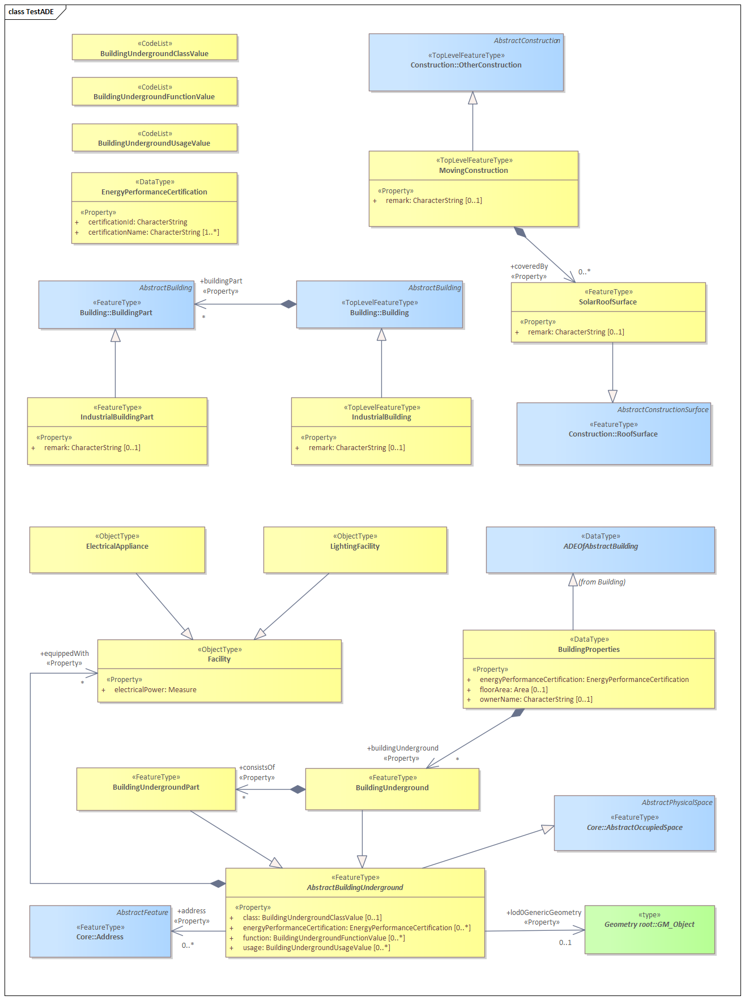

# extension-test-ade
---
The ‘TestADE’ is an artificial CityGML ADE (Application Domain Extension) which has been primarily designed for demonstrating how to employ the citygml4j and 3DCityDB software APIs to work with the realworld CityGML ADEs. This ADE includes a couple of feature and data types  originated from the existing CityGML ADEs e.g. Energy ADE and UtilityNetwork ADE. Please note that compared to the original ADE models, some classes of this TestADE have been simplified by omitting some attributes and properties in order to make this artificial ADE light-weight for software tests purpose.

UML Data Model
-------

